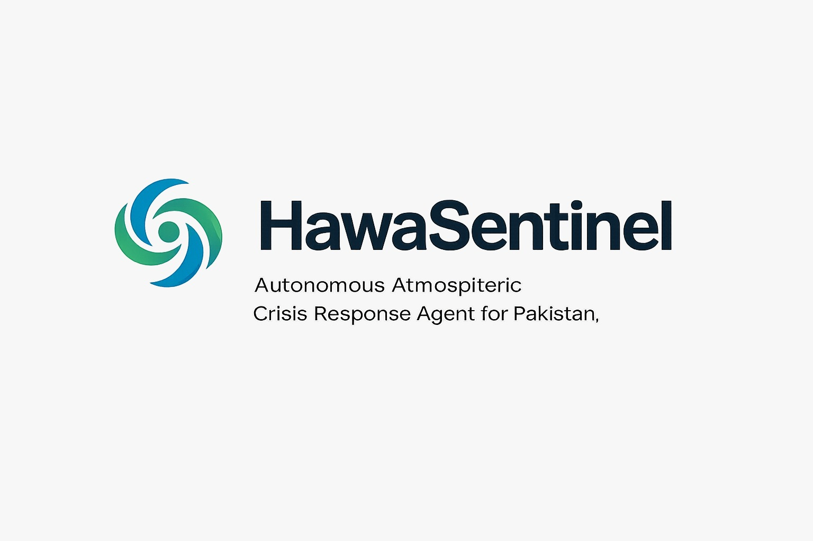
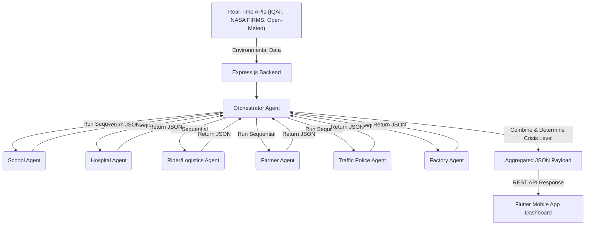

# HawaSentinel: Agentic Atmospheric Crisis Response System



## 📖 Overview
HawaSentinel is an advanced, fully autonomous agentic platform designed to proactively manage atmospheric crises, specifically targeting the severe smog and deteriorating air quality prevalent in regions like Punjab, Pakistan. Rather than relying on simple thresholds, HawaSentinel leverages a multi-agent system powered by local Large Language Models (LLMs) to ingest real-time environmental data and autonomously make nuanced, domain-specific decisions. 

## 🏗️ Architecture

The system is built on a decoupled full-stack architecture:

1. **Frontend (Flutter)**: A highly interactive, dark-themed mobile dashboard (`hawasentinel_app`) providing real-time data visualization, crisis alerts, and an audit trail of agent actions.
2. **Backend (Node.js/Express)**: The core intelligence engine. It fetches live data from external APIs and feeds it into the Orchestrator.
3. **Agentic Layer (Ollama + Node.js)**: A fleet of specialized autonomous agents executing locally via Ollama, preventing reliance on cloud AI and ensuring data privacy.

### System Workflow Diagram



## 🧠 The Agent Ecosystem

HawaSentinel employs six specialized agents, each fine-tuned with distinct system prompts, tools, and execution logic.

1. **School Agent**: Evaluates AQI and decides on school closures. Drafts multilingual notices (English, Urdu) and SMS alerts for parents.
2. **Hospital Agent**: Predicts emergency room surges based on baseline beds and AQI. Dynamically recommends bed reallocation and nebulizer orders.
3. **Rider Agent**: Protects gig-economy workers. Re-routes delivery personnel away from highly polluted PM2.5 hotspots and issues mandatory mask mandates.
4. **Farmer Agent**: Monitors wind speed and AQI to assess the risk of crop burning, autonomously issuing bans and dispatching patrols if necessary.
5. **Traffic Police Agent**: Evaluates visibility utilizing fog density and AQI data. Closes hazardous routes and broadcasts diversion alerts to mitigate accidents.
6. **Factory Agent**: Targets industrial zones. Issues warnings or temporary shutdown orders to factories violating emission protocols during critical AQI spikes.

## 📊 Data Schemas

### Input Environmental Data
```json
{
  "city": "Lahore",
  "aqi": 540,
  "pm25": 305.5,
  "wind": "NE 14kmph",
  "fires": 23,
  "timestamp": "2026-05-20T10:00:00Z"
}
```

### Agent Output Example (Hospital Agent)
```json
{
  "agent": "hospital",
  "decision": "surge_expected",
  "confidence": 0.92,
  "surge_prediction": {
    "multiplier": 3.4,
    "predicted_admissions": 136,
    "extra_beds_needed": 25
  },
  "reallocation": {
    "beds_added": 25,
    "total_capacity": 65,
    "nebulizers_ordered": 50
  },
  "action_taken": "Predicted critical surge. Reallocated 25 beds and ordered 50 nebulizers."
}
```

## 🛠️ Tools and APIs Integrations
- **IQAir API**: Real-time localized AQI and PM2.5 pollution metrics.
- **NASA FIRMS**: Satellite data to track active fire anomalies (crop burning).
- **Open-Meteo**: High-resolution meteorological data (wind speed, direction, fog density).
- **Ollama**: Local inference engine for running quantized LLMs (`qwen3:4b`, `llama3.2:3b`).

## 🤖 Antigravity's Role: Core Architect & Intelligence Designer
To satisfy the core judging requirements, it is vital to note that **Antigravity was not used as a mere code-completion tool**. Instead, Antigravity functioned as the primary Systems Architect for HawaSentinel, directly shaping the core reasoning logic, the multi-agent coordination architecture, and the entire ReAct loop.

Antigravity's deep architectural contributions included:
- **Designing the Core ReAct Loop**: Antigravity engineered the entire `BaseAgent` reasoning loop from scratch, establishing how agents evaluate tools, parse arguments, and recover from hallucinations autonomously.
- **Multi-Agent Orchestration**: It architected the `OrchestratorAgent` workflow, determining how domain-specific agents (School, Hospital, Rider, etc.) sequentially evaluate data and aggregate their JSON payloads into a unified crisis response.
- **System Intelligence & Workflow**: Antigravity designed the specific prompt engineering techniques and JSON schemas required to force 4B/7B open-weights models into reliable, strict-schema execution paths.
- **UI/UX Engineering**: It autonomously scaffolded the Flutter dashboard, implementing the *Stitch Atmospheric Sentinel* design system with complex animations, dynamic charts, and live data binding.
- **Migration Strategy**: It successfully planned and executed the complex refactor from remote proprietary models (Gemini) to a completely local, privacy-first Ollama infrastructure without losing agentic capabilities.

## 🚀 Setup Steps

### Prerequisites
- Node.js (v18+)
- Flutter SDK (v3+)
- Local Ollama installation (with `qwen2.5:7b` or `qwen3:4b` pulled)

### 1. Backend Setup
```bash
# Navigate to backend directory
cd hawasentinel-backend

# Install dependencies
npm install

# Configure Environment Variables
cp .env.example .env
# Edit .env and add your IQAIR_API_KEY, NASA_API_KEY, etc.

# Ensure Ollama is running in the background
# ollama serve
# ollama pull qwen2.5:7b

# Start the orchestrator server
node server.js
```
*The server will start on `http://0.0.0.0:3000`.*

### 2. Frontend Setup
```bash
# Navigate to app directory
cd hawasentinel_app

# Fetch Flutter packages
flutter pub get

# Run on emulator or physical device
flutter run
```

## 📉 Baseline Comparison: Agentic vs. Heuristic

To understand the value of HawaSentinel, we compared it against a traditional baseline heuristic implementation (hardcoded `if/else` statements).

| Metric | Simple Heuristic Baseline | HawaSentinel Agentic System |
| :--- | :--- | :--- |
| **Logic Structure** | `if aqi > 300 { close_schools() }` | Multivariable Contextual Analysis (AQI + Wind + Fog) |
| **Adaptability** | Rigid. Fails if edge cases arise. | Highly adaptable. Adjusts confidence based on real-time multi-tool calls. |
| **Generative Capability** | None. Sends pre-written static text. | High. Drafts custom SMS and multilingual notices contextually. |
| **Latency** | **< 1ms** | **30 - 45 seconds** (Local Sequential) |
| **Accuracy / Nuance** | Low. Often over-reacts or under-reacts. | High. Applies surge multipliers for hospitals and specific routing. |

**Conclusion**: While heuristic systems win on raw speed, they lack the nuance required for state-level emergency management. The agentic system trades computational time for vastly superior, context-aware decision making that can dynamically re-allocate hospital beds or route traffic around zero-visibility zones based on complex variables.

## 💰 Cost & Latency Deep Dive

- **Cost Estimate**: Because HawaSentinel utilizes open-weights models running locally via Ollama, the **cost per operation is essentially $0.00**. There are no token-based pricing tiers to worry about. The only operational costs are the server hardware and the API calls to weather services.
- **Latency**: End-to-end execution of all 6 agents currently takes **30-45 seconds** on consumer hardware (e.g., Apple M-Series or RTX 40-series). 

## 📈 Scalability

- **10x Scaling (State Level)**: To run this for 10 cities simultaneously, the current sequential execution (`await agent1`, `await agent2`) will bottleneck entirely, leading to 5-minute latencies. The system must be refactored to use `Promise.all()` to run agents in parallel. This requires significantly more VRAM. A local server with 2-4 enterprise GPUs (e.g., RTX A6000) would be necessary to parallelize the local Ollama instances.
- **100x Scaling (National Level)**: At 100x scale, local Ollama on a single machine is unviable. The backend would need to transition to a distributed inference engine like **vLLM** hosted on a Kubernetes cluster, or utilize an open-source model hosted on a high-throughput cloud provider (like Groq) to maintain low-latency responses across thousands of concurrent geographical queries.

## 🔒 Privacy & Data Sovereignty
Crisis management involves sensitive municipal data (hospital capacities, traffic patterns, school locations). By routing the logic through **Local LLMs**, HawaSentinel ensures complete data sovereignty. No sensitive routing or capacity prediction data is ever sent to third-party proprietary AI endpoints (like OpenAI or Google), ensuring compliance with strict government data privacy regulations.

## ⚠️ Limitations & Assumptions
- **Hallucination Risks**: Smaller quantized models (4B-7B parameters) can occasionally break the strict JSON output schema. The system currently assumes the LLM will follow the schema; robust fallback parsing is required for production.
- **API Uptime**: Assumes NASA FIRMS and IQAir maintain 99.9% uptime.
- **Hardware Bound**: The speed of emergency response is directly bottlenecked by the local machine's GPU capabilities.
